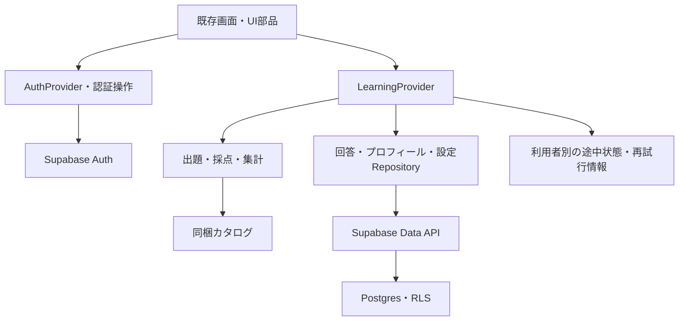

# Supabase統合の実装計画

作成日：2026-10-07。対象：posse-zunzunのWeb／PWA。現在は実装中。認証・同期コードを追加し、dev DBへマイグレーションを適用済み。Auth実アカウントでの登録・ログイン・RLS動作検証とproduction DBへの適用は未実施。テーブル名・モジュール名・内部処理は実装に合わせて更新する。

## 1. 目的と初期版の範囲

現在のクイズ体験とデザインを保ちながら、メール＋パスワードでログインし、本人の回答履歴と設定をSupabaseに保存する。別のブラウザでも確定済みの学習記録を確認できる状態を目指す。

| 項目 | 確定した方針 |
| --- | --- |
| 対象・配信 | Web／PWAを先行し、EAS Hostingで配信。まず無料枠で運用する |
| 認証 | Supabase Authのメール＋パスワード。「SSO」は通常のログインの意味であり、OAuth・SAMLは追加しない |
| 登録範囲 | POSSE内でURLを案内するが、外部の人の登録も許容する。所属確認・招待・承認・メールドメイン制限は設けない |
| 問題・採点 | Gitの正本と同梱JSON、端末での採点を維持する。問題・正答をDBへ移さない |
| DBに保存するもの | プロフィール、回答済み履歴、学習設定 |
| 端末に残すもの | 出題順、現在位置、未確定入力、通信失敗からの再試行情報。認証ユーザー別に分離する |
| 回答確定 | オンラインでDB保存を確認してから確定する。オフラインでの回答確定は初期範囲外 |
| 既存記録 | 未認証のローカル記録は取り込まず、ログイン導入後の新しい記録から始める |
| 記録の用途 | 本人の復習・進捗確認。ランキングや公式成績の根拠にはしない |
| デザイン | レイアウト、色、余白、書体、素材、既存のフィードバックを維持する |

Native対応、問題のDB配信、運営向け閲覧権限、管理画面、オフライン回答、学習スケジュールの新機能は今回の実装に含めない。

## 2. 現状と変更が必要な箇所

- Expo SDK 57／Expo Routerで、Webは静的書き出し。問題は33単元・394問を同梱している。
- [LearningProvider](../src/lib/progress/provider.tsx)が途中状態と回答履歴を一つの`Progress`として管理し、変更のたびに端末へ保存している。
- [session.ts](../src/lib/quiz/session.ts)が出題、採点、回答生成、XP・連続日数・復習候補の集計を担う。
- Webの保存キーは`posse-zunzun:learning:v1`で、ユーザーごとの区別がない。
- [登録画面](../src/app/onboarding.tsx)と[アカウント画面](../src/app/account.tsx)は雛形。登録・ログアウト・設定保存は認証やDBにつながっていない。
- Supabase SDK、メール＋パスワード登録／ログイン、認証ルート、ユーザー別の端末保存、回答のData API adapter、プロフィール・学習設定・回答履歴のRLS付きマイグレーションを追加済み。dev（`posse-quiz-app-dev`）にマイグレーションを適用済み。Authの実アカウント検証とproduction DBへの適用は未実施。
- devの`.env.local`は設定済み。Auth公開設定の読み取りはHTTP 200で確認済みだが、ログイン・メール配送・DB・RLSは未検証。本番プロジェクトは別途作成済みで、接続値は未設定。

環境変数は`EXPO_PUBLIC_SUPABASE_URL`と`EXPO_PUBLIC_SUPABASE_KEY`に統一する。詳細は[environments.md](environments.md)を参照する。実値はこの計画やテンプレートに転記しない。

## 3. 統合後の構成

DBを回答履歴・設定の正本とする。端末保存は途中状態とキャッシュを担う。画面からのDB呼び出しをRepositoryへ集約し、独立したAPIサーバー・Edge Functions・Realtimeは初期構成に追加しない。

追加・変更するファイルの案：

| パス | 責務・変更内容 |
| --- | --- |
| `src/lib/supabase/client.ts` | 接続値の検証、型付きクライアントの生成。ブラウザの認証セッション設定 |
| `src/lib/supabase/database.types.ts` | スキーマから生成するDB型 |
| `src/lib/auth/provider.tsx` | 認証の初期復元、状態変化、ログイン・ログアウト・復旧操作 |
| `src/lib/auth/profileRepository.ts` | 本人のプロフィール取得・初期作成・更新 |
| `src/lib/progress/answerRepository.ts` | 回答の追加、重複確認、本人の履歴取得、既存型への変換 |
| `src/lib/progress/settingsRepository.ts` | 本人の学習設定の取得・更新 |
| `src/lib/progress/provider.tsx` | DB履歴と端末の途中状態を統合。入力変更と回答保存を別の操作に分ける |
| `src/lib/progress/storage.web.ts` | ユーザー別保存キーと再試行情報。既存の未認証記録は読み込まない |
| `src/lib/quiz/session.ts` | 採点と回答候補の計算を再利用。DBで受理された回答の確定処理を分離する |
| `src/lib/progress/presentation.ts` | DB由来の履歴・選択フェーズを既存の画面表示に接続 |
| `src/app/_layout.tsx` | AuthProviderをLearningProviderの外側に配置し、ルートを保護する |
| `src/app/login.tsx`、`src/app/auth/callback.tsx`、`src/app/auth/reset-password.tsx` | 追加する認証用画面。既存のフォーム・ボタン・画面部品を使う |
| `src/app/onboarding.tsx`、`src/app/account.tsx`、`src/app/quiz.tsx` | 実際の登録・設定保存・ログアウト・回答保存に接続する |
| `supabase/` | CLI設定、マイグレーション、RLS検証用の資材 |
| `public/sw.js` | 認証導入後のキャッシュ方針と既存Service Workerからの更新 |

ファイル分割は実装時に調整できる。`src/app/`には画面だけを置き、DB・認証の処理は`src/lib/`へ置く。

## 4. データ設計の案

### 4.1 認証・プロフィール・設定

認証情報はSupabaseの`auth.users`に任せる。アプリ側のテーブルにパスワード・アクセストークン・リフレッシュトークンを保存しない。

| テーブル | 主なカラム | 制約・用途 |
| --- | --- | --- |
| `profiles` | `user_id uuid`、`display_name text`、`posse text nullable`、`cohort text nullable`、`created_at timestamptz`、`updated_at timestamptz` | `user_id`を主キーかつ`auth.users.id`への外部キーにする。名前の長さ等を制限する |
| `learning_settings` | `user_id uuid`、`phase text`、`created_at timestamptz`、`updated_at timestamptz` | 同じ主キー・外部キー。`phase`は`ph1`／`ph2`に制限する |

所属・期生は任意の自己申告情報であり、権限判定に使わない。既存の選択肢は仮の表示なので、実際の値は実装時に確認する。未選択でも登録できるようにする。PH3は問題がないため、既存の見た目を保ちつつ選択不可などの最小限の表示にする。

プロフィールと設定は最初の認証完了後に、存在しない場合だけ作成する。毎回のログインやトークン更新で初期値を上書きしない。確認メールを別ブラウザで開く場合に備え、登録時の表示名等をAuthの`user_metadata`へ一時的に渡す案とするが、プロフィールの初期値にのみ使い、アクセス権限には使わない。

`updated_at`はDB側で更新し、設定の同時変更は最後にDBへ保存された値を採用する初期案。設定は全体JSONの上書きではなく、変更対象のカラムを更新する。アカウント削除時の履歴削除・保持方針は別途決めるまで、削除UIや自動削除を追加しない。

### 登録画面から取得する情報

登録項目の根拠は[src/app/onboarding.tsx](../src/app/onboarding.tsx)。画面には次の6項目の入力stateが既にあり、追加の登録項目を新しく設ける必要はない。

| 画面の項目 | 現在のstate・型 | 登録時の受け渡し先 | 必須／任意の初期案 |
| --- | --- | --- | --- |
| 名前 | `name: string` | Auth登録時の表示用metadata `display_name` → 初回認証後の`profiles.display_name` | 必須 |
| メールアドレス | `mail: string` | Supabase Authの`email` | 必須 |
| パスワード | `password: string` | Supabase Authの`password` | 必須 |
| 所属POSSE | `posse: string \| null` | 表示用metadata `posse` → `profiles.posse` | 任意。未選択は`null` |
| 期生 | `generation: string \| null` | 表示用metadata `cohort` → `profiles.cohort` | 任意。未選択は`null` |
| 学習フェーズ | `phase: PhaseId`（初期値`ph1`） | 表示用metadata `phase` → `learning_settings.phase` | 必須。現行の問題があるPH1／PH2 |

所属・期生は任意項目で、未選択でも登録できる。選択した値はAuth metadataを経由して`profiles`へ保存する。

現行コードにある値と注意点：

- 現在の選択肢は所属POSSEが`POSSE①`〜`POSSE③`、期生が`1期生`〜`7.5期生`の0.5刻み。以前の角括弧付き値を保存時に除外していたため、未設定になった既存プロフィールはアカウント画面から再選択できるようにした。
- フェーズの入力値は`ph1`／`ph2`／`ph3`、表示は`PH1`／`PH2`／`PH3`。DBには`ph1`／`ph2`を保存し、既存の`PhaseId`へ対応させる。PH3は未対応。
- パスワード欄の表示は「8文字以上」。これに合わせた入力検証を追加し、Supabase側の実際のパスワード条件も確認する。表示だけでは条件を満たしたことにならない。
- メールの`example@posse.jp`は入力例であり、ドメイン制限ではない。
- 「登録してはじめる」は6項目を収集し、入力検証後にSupabase Authへ渡す。
- パスワードは認証呼び出しにのみ渡し、表示用metadata・プロフィール・端末の学習保存・URL・ログに含めない。

### 4.2 回答履歴

`answer_records`は一問ごとの追記型とし、確定済み回答を後から上書きしない。

| カラム | 型の案 | 意味 |
| --- | --- | --- |
| `user_id` | `uuid` | 所有者。`auth.users.id`への外部キー |
| `record_id` | `text` | 既存の回答ID。`${sessionId}:${questionId}`を維持する |
| `session_id` | `text` | 端末で開始したクイズの識別子。Authセッションとは別 |
| `question_id` | `text` | 同梱問題の安定したID |
| `revision` | `integer` | 回答した問題の版。1以上 |
| `week_unit_id` | `text` | 回答時の単元ID |
| `option_id` | `text` | 現行の選択結果。Git模擬操作等の既存表現も維持 |
| `correct`、`hint_used` | `boolean` | 端末での採点結果・ヒント使用 |
| `received_at` | `timestamptz` | DBで受理した時刻。DB側で設定し、利用者は指定・更新できない |

- 主キーは`(user_id, record_id)`。さらに`(user_id, session_id, question_id)`を一意にし、同じ回答の再送を防ぐ。
- `record_id`とセッション・問題IDの対応、文字列の長さ、必須項目を制約で確認する。既存の復元処理が要求するID形式と一致させる。
- 履歴のページ取得用に`(user_id, received_at, record_id)`の索引を検討する。主キーと重複する索引は増やさない。
- 問題テーブルは作らないため、問題へのDB外部キーは設けない。問題ID・版はクライアントのカタログとの対応で扱う。
- XPは別の更新値として保存せず、既存仕様の「回答5＋正解5」を`correct`から算出する。Repositoryで既存の`AnswerRecord.xp`へ変換する。
- `received_at`を`AnswerRecord.at`に変換し、受理された日時で記録を表示する。問題が改訂されても履歴は保持し、現行版の習得判定と過去の回答件数を区別する。
- 未確定のコード全文・実行ログ・トークン列はDBへ送らず、現行の確定回答の表現を引き継ぐ。

端末採点のため、DBは正誤の真実性を保証しない。RLSは他人の記録へのアクセスを防ぐための仕組みであり、自己申告の正誤を公式成績にする仕組みではない。

### 4.3 アクセス権とRLS

すべてのアプリ用テーブルでRLSを有効にし、Data APIの権限も明示する。既存プロジェクトの自動付与に依存しない。[SupabaseのData API保護](https://supabase.com/docs/guides/api/securing-your-api)に従う。

| 対象 | `anon` | `authenticated` | 行の条件 |
| --- | --- | --- | --- |
| `profiles` | 読み書き不可 | SELECT／INSERT／UPDATE | 本人の`user_id`だけ |
| `learning_settings` | 読み書き不可 | SELECT／INSERT／UPDATE | 本人の`user_id`だけ |
| `answer_records` | 読み書き不可 | SELECT／INSERT | 本人の`user_id`だけ。UPDATE／DELETE不可 |

SELECTは`(select auth.uid()) = user_id`を`USING`で確認し、INSERTは`WITH CHECK`で確認する。UPDATEにはSELECTの許可に加えて`USING`と`WITH CHECK`の両方を設け、所有者の付け替えを拒否する。`received_at`等のDB管理カラムはINSERT可能なカラムから外す。[RLSの公式ガイド](https://supabase.com/docs/guides/database/postgres/row-level-security)

クライアントにはpublishable keyだけを渡す。secret／service_role keyを`EXPO_PUBLIC_*`へ置かない。表示用の`user_metadata`、自己申告の所属、画面上のユーザーIDチェックを権限の根拠にしない。

## 5. 認証と画面遷移

### 5.1 状態の分離

`AuthProvider`の認証復元と、`LearningProvider`の履歴読み込みを別の状態にする。

| 状態 | 画面・動作 |
| --- | --- |
| 認証復元中 | 読み込み表示。未ログインとして先にリダイレクトしない |
| 未ログイン | 登録・ログイン・パスワード再設定の申請・メールの戻り先だけを利用可能にする |
| 確認メール待ち | 確認手順と再送操作を案内する。登録成功だけでホームへ進めない |
| ログイン済み・履歴取得中 | 学習データの読み込み表示 |
| ログイン済み・DB取得失敗 | 再試行を表示する。空の履歴とみなして上書きしない |
| 利用可能 | ホーム・教材・クイズ・記録・アカウントを利用可能にする |
| セッション失効 | 再ログインを案内し、回答の新規確定を止める |

ルート保護はExpo Routerで行い、直接URLを開いた場合も確認する。保護画面のHTMLに個人データを静的出力しない。ブラウザ専用APIをexport時に実行しない。クライアントの画面保護とは別に、DBへのアクセスはRLSで保護する。[Expo Routerの認証](https://docs.expo.dev/router/advanced/authentication/)

### 5.2 実装する認証操作

- 登録：既存の`onboarding.tsx`からメール＋パスワードで登録する。送信中の二重操作を防ぎ、入力エラー・通信失敗を案内する。
- ログイン：既存のフォーム部品で画面を追加し、メール＋パスワードで認証する。
- メール確認：確認必須を推奨案とし、dev／productionの設定を明示して揃える。再送・期限切れの案内を含める。
- パスワード再設定：メール送信申請→戻り先で復旧セッションを確認→新パスワード保存。復旧リンクで通常のホームへ自動遷移しない。
- ログアウト：SDKの認証セッションを終了し、表示中の個人データと送信処理を切り離す。
- メールアドレスはAuthから表示する。メール変更や退会画面は初期の必須フローに追加しない。

静的Web向けには、SDKがURL fragmentのセッションを処理するimplicit flowを初期案とする。ブラウザ側でURL検出を有効にし、確認・復旧を認証ゲートより先に処理する。トークンをログや学習記録へ保存せず、処理後は認証情報をURLから除去する。Native向けの`detectSessionInUrl: false`をWebへそのまま適用しない。[implicit flow](https://supabase.com/docs/guides/auth/sessions/implicit-flow)、[パスワード認証](https://supabase.com/docs/guides/auth/passwords)

Site URL・許可するRedirect URL・メールの戻り先を環境別に設定する。戻り先は既知のアプリ内ルートに限定し、任意URLへ遷移させない。[Redirect URLs](https://supabase.com/docs/guides/auth/redirect-urls)

Supabase標準のメール配送は一般利用者への本番配信には使わず、custom SMTPを設定する。本番用の送信元ドメインは利用可否が未確認。メール認証方式を変えたり、確認を無断で無効化したりせず、ローカルのMailpit等で実装・検証を進める。[SMTPの制約](https://supabase.com/docs/guides/auth/auth-smtp)

## 6. 回答保存と再試行

現行の`mutate()`にDB保存を一律追加すると、キー入力や「次へ」まで通信対象になる。途中入力の端末保存と、確定回答のDB保存を別の操作に分ける。

1. 既存ロジックで回答候補を生成する。HTML／Consoleの実行確認やGit模擬操作の完了条件を保つ。この段階では確定履歴・XPへ追加しない。
2. 所有者ID・回答ID・問題版・選択結果・採点結果を固定し、再試行に必要な情報を本人の端末領域へ保存する。失敗した場合は送信せず案内する。
3. 送信中はその回答の編集・二重送信・次問への移動を止める。
4. `answer_records`へINSERTし、DBで受理された行を取得する。
5. 同じIDの行が既にある場合はSELECTして内容を比較する。同じ内容なら既存行を成功として受け取り、異なる内容なら競合として止める。確定済み行をupsertで上書きしない。
6. 受理された行を既存の`AnswerRecord`へ変換し、IDで重複排除して表示へ反映する。この時点で正誤・解説・XP・進捗を確定する。
7. 端末の再試行情報を解消する。「次へ」は本人の端末のカーソルだけを更新する。

| 失敗・競合 | 対処 |
| --- | --- |
| 送信前にオフライン | 確定しない。同じ問題・入力を保ち、通信回復後に本人が再試行する |
| INSERT成功後に応答が届かない | 同じ回答ID・固定した内容で再試行し、既存行の確認で復旧する |
| DB成功後に端末保存が失敗 | DBの行を正本として再読み込みする。新しいIDで送信し直さない |
| 認証期限切れ | 同じ本人の再ログイン後に再試行できる。別の利用者には引き継がない |
| 問題更新後の再開 | 確定済み履歴は保持する。既存の版チェックで途中セッションを判定し、古い版の未送信候補は新規確定しない。送信結果が不明なら先にDBの同じIDを確認する |
| アカウント切り替え中に通信が完了 | 呼び出し時のユーザーIDと世代番号を確認し、新しい利用者の画面・保存領域へ結果を反映しない |

再試行時に内容を比較する対象は問題・版・単元・選択・正誤・ヒント等とし、DBが付ける日時は比較対象にしない。送信を諦める場合も、DBへ既に保存されたか確認するまでは別内容の回答へ差し替えない。

## 7. 端末保存・同期・集計

- 新しい保存キーは例として`posse-zunzun:learning:v2:${userId}`とする。旧`v1`は読み込み・取り込みをせず、そのまま残す。
- 認証ユーザーの変更時に、状態・キャッシュ・処理キューを切り替える。実行中の古い処理にも世代確認を入れ、単にキューを空にするだけで済ませない。
- ログイン、アプリへ戻った時、記録の更新操作などで本人の履歴・設定を取得する。初期版はRealtimeを使わない。
- 履歴はページ単位で取得し、`received_at`と`record_id`で安定した順序にする。初期版は同期時に全ページを確認し、DBの取得件数上限で履歴を欠落させない。回答保存のたびに全履歴を取得する必要はなく、受理した一行を取り込む。
- 全ページの取得が終わるまでは完全な集計として扱わない。通信失敗時は既存キャッシュを保持し、未完了の同期を完了表示にしない。増分同期は件数・通信量を確認してから追加する。
- 別端末の回答はIDで統合し、他端末の途中セッション・順序・カーソルは取得しない。自端末の未確定入力は維持する。
- XP、復習候補、習得数、連続日数は確定済み履歴から算出する。並び順を固定して、同じ履歴なら両端末で同じ結果にする。
- 日時はUTCで保存する。連続日数・カレンダーの日付境界は日本時間を共通にする推奨案。現行の端末ローカル日付による計算を変更する際は、仕様として確定して日付またぎを検証する。
- `CURRENT_PHASE`固定やアカウント画面の一時的な選択を、DBの学習設定に接続する。既存の表示ヘルパーとスタイルを活用する。

## 8. 実装順序と各段階の完了条件

最初の到達点は「ログイン→3問回答→DBへ保存→別ブラウザで同じ履歴を表示」とする。その後に復旧・競合・本番運用を仕上げる。

| 段階 | 作業 | 完了条件 |
| --- | --- | --- |
| 0：準備 | 現行コード・SDK・CLIの版を確認。マイグレーションを作成。ローカルSupabaseの準備 | CLI認証・devプロジェクト連携済み。ローカルDocker daemonは未起動 |
| 1：認証の土台 | Supabase client、AuthProvider、ログイン、登録、ルート保護、ログアウト | 実装中。コード追加済み、Auth実アカウントは未検証 |
| 2：DB・権限 | 3テーブル、制約、最小GRANT、RLS、DB型、プロフィール・設定の初期作成 | マイグレーション・型を作成しdevへ適用済み。RLSのData API検証は未実施 |
| 3：回答保存 | Repository、回答候補と確定処理の分離、本人別の端末保存、同一IDでの再試行、履歴取得 | コード追加済み。dev DB適用済み。別ブラウザ同期・再送はAuth実アカウントで検証が必要 |
| 4：設定・復旧・回帰 | アカウント・ホームの設定連動、確認メール再送、パスワード再設定、期限切れ、アカウント切り替え、問題版変更 | 途中入力を他端末へ移さず、別利用者の記録が混ざらない。既存の全問題形式が動く |
| 5：本番準備 | PWAキャッシュ更新、EAS検証配信、SMTP、production接続値・Auth設定、互換マイグレーション、バックアップ・公開手順 | 本番候補で登録から回答・再ログイン・復旧まで検証し、確認済みの配信を本番へ昇格できる |

段階ごとにレビューできる変更として分ける。デザイン変更や新しい問題制作を同じ変更へ混ぜない。

### 開発の進め方

1. Expo SDK 57の対応する公式資料を確認し、依存はリポジトリ規約に従って`npx expo install`で追加する。Supabase SDKの採用版を固定し、lockfileも管理する。
2. CLIの`--version`と各コマンドの`--help`を確認する。現状は`supabase/`がないため、初期案はマイグレーションで管理する方式とする。
3. スキーマ・RLSの試行はローカルDBで行う。advisorsと所有者分離の検証後、CLIでマイグレーションを生成・レビューする。ファイル名の日時を手書きしない。
4. ローカルの空DBでマイグレーションを再適用して再現性を確認し、devへ適用する。DB型を生成し、アプリ側の型との変換を検証する。
5. リモートdevはローカル開発と検証配信の共用を初期案とする。破壊的なテストを共用devやproductionで行わない。

## 9. 検証計画

| 観点 | 必須の確認 |
| --- | --- |
| Auth | 登録、確認待ち、確認メール、再送、ログイン失敗、再読み込み、期限切れ、ログアウト、パスワード復旧・期限切れリンク |
| RLS・権限 | AはAの行だけ取得・追加・更新できる。BのIDを指定してもBの行を読めない・変更できない。所有者変更、回答UPDATE／DELETE、未認証アクセスを拒否 |
| 再試行 | 応答消失、二重クリック、再読み込み後の再送、同一IDで異なる内容、DB成功後の端末保存失敗 |
| 同期 | 複数ブラウザで回答が統合される。設定が保存される。件数上限を超える履歴も取得でき、同時刻の行でも順序が安定する |
| 分離・版管理 | A→Bへの切り替え中の遅延応答、旧ローカル記録を無視、途中入力の端末限定、問題改訂後の履歴保持 |
| 採点・実行 | choice／HTML／Console／Git。実行前に確定できない条件、ヒント、再回答、XPの既存仕様を維持 |
| 集計・表示 | 未回答、正解・不正解、古い問題版、日付境界、PH1／PH2、DB取得失敗時の表示 |
| デザイン・配信 | 元のスタイルと比較し、スマホ幅で視覚確認。認証ルートの直接アクセス・メール遷移・PWAの旧キャッシュからの更新 |

RLSはservice_roleだけで検証せず、publishable key＋各利用者のセッションでData APIを呼び出して確認する。テスト利用者はローカルまたはdevの専用アカウントを使う。

実装時の基本チェックは`npm run typecheck`、`npm run lint`、`npm test`、`npm run export:web`。認証・保存の新しいテストとRLSの統合テストを追加する。問題自体を変更する場合は、別途既存のコンテンツ検証・生成手順も実施する。

## 10. EAS Hostingと本番移行

1. devとproductionのURL・publishable keyをそれぞれEASの環境へ設定する。export時に値が埋め込まれるため、deploy時の切り替えだけで済ませない。[EASの環境変数](https://docs.expo.dev/eas/environment-variables/usage/)
2. devの値で書き出した検証配信でAuth・DB・既存クイズを確認する。本番の書き出しにはdevの`.env.local`を混入させない。
3. productionに同じマイグレーションを適用する。変更前にバックアップを取り、旧フロントも動く追加・互換性を保った変更を先に配信する。
4. production用のSite URL、戻り先、メール配送を設定する。初期版の公開に所属確認の設定は必要ない。
5. productionの値で別途exportし、本番候補の固有URLで検証する。確認済みの同じデプロイを本番aliasへ昇格する。[EASのデプロイとalias](https://docs.expo.dev/eas/hosting/deployments-and-aliases/)
6. 不具合時は前のフロントのデプロイへ戻す。通常のロールバックで回答データを削除・復元し直さず、新DBとの互換性を維持する。

現行の`sw.js`はページや静的ファイルをキャッシュする。本番公開前に認証の戻り先・トークン付きURL・Supabase応答をキャッシュ対象から外し、HTML／JSの古い配信が残ることを防ぐ。旧Service Workerからの更新も確認し、認証ストレージや本人の途中入力はキャッシュ更新のために消さない。[ExpoのPWAガイド](https://docs.expo.dev/guides/progressive-web-apps/)

CIはtypecheck・lint・既存テスト・Web exportを基本にする。コンテンツ検証に必要な`curriculum`、`drill-ph1`、`drill-ph2`は参照先の取得権限と版を固定し、`QUIZ_WORKSPACE`を設定する。EASの配信自動化・production DB適用は、環境と検証手順が整ってから接続する。

無料枠を前提に、履歴取得の通信量とDB容量を確認する。バックアップは外部への暗号化保管と復元テストを設計し、AuthのユーザーIDと履歴の参照関係も復元対象として確認する。自動バックアップがあるものとして運用しない。[Supabaseのバックアップ](https://supabase.com/docs/guides/platform/backups)

## 11. 実装・公開前に確定する残件

| 項目 | いつ必要か | 現時点の扱い |
| --- | --- | --- |
| productionのURL・publishable key | 本番候補のexport前 | 未設定。devの値で代用しない |
| EASのプロジェクト・検証／本番URL | メール戻り先・配信設定時 | 固有URLと本番aliasを区別して決める |
| 送信元ドメイン・custom SMTP | 本番のメール確認・復旧の検証前 | ドメイン利用可否を確認。無料サービス候補としてResend等を比較する |
| メール確認必須の設定 | 認証フロー実装時 | 推奨案。devの現設定を読み取り、本番と揃える |
| 登録項目の入力条件・選択肢 | 登録画面の接続時 | onboardingの6項目を採用。必須／任意の初期案は4.1を参照。所属・期生の実際の候補と入力制約を確定する |
| 日付境界 | 連続日数・カレンダーの接続時 | 日本時間で統一する推奨案を仕様として確定する |
| データ保持・退会・バックアップ運用 | 本番運用開始前 | 保持範囲・復元手順を決める。退会機能の追加は別途判断する |

これらは前段の開発を一括で止める理由ではない。devとローカルで認証・RLS・回答保存の実装を進め、本番のメール配送・環境設定が揃ってから公開する。

## 12. 最終的な完了条件

- 本番候補で登録・メール確認・ログイン・復旧・ログアウトが動く。
- ログイン中の本人だけが、自分のプロフィール・設定・回答履歴を読み書きできる。
- DB保存を確認する前に回答・XPを確定せず、再送で重複しない。
- 別ブラウザで確定済み記録・設定が同期され、途中入力や別利用者のデータは混ざらない。
- 既存の394問、採点・実行条件、画面デザインを維持する。
- dev／productionが分離され、検証したデプロイの昇格・切り戻しとバックアップ復元の手順がある。

本計画の作成だけでは、これらの条件を達成したことにはならない。実装・検証結果は各段階で別途記録する。
